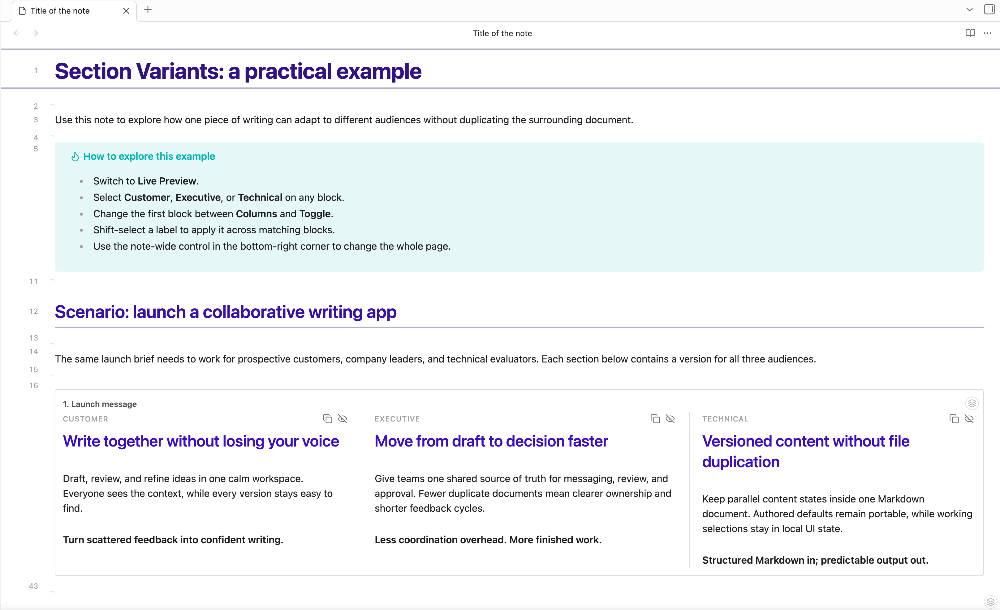
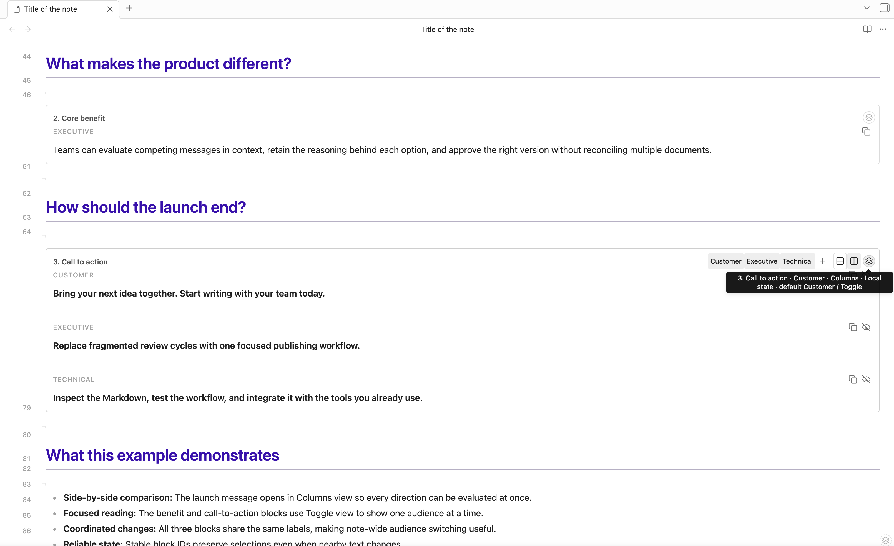

# Section Variants

Section Variants lets you switch, compare, and manage parallel versions of a Markdown section without splitting them across notes.

## Screenshots

### Compare variants side by side



### Switch audiences and control each block



## Syntax

Use a Pandoc fenced div containing two or more labeled variant divs:

```markdown
:::: {.variants #introduction name="Introduction options" view="columns" default="Short"}

::: Short
A concise introduction.
:::

::: {.variant label="Long version"}
A longer introduction with more context.
:::

::::
```

Safe single-token labels use shorthand. Labels containing spaces or punctuation use the explicit `.variant` form. Supported block attributes are:

- `#id`
- `name="Box title"`
- `view="toggle|columns"`
- `default="Label"`
- `widths="2fr 1fr"` (generated from column ratios)
- `responsive="responsive|stack|scroll"`

The canonical container is `variants`. Additional aliases can be enabled in **Settings → Section Variants**.

## Using variants

- Hover or focus a bordered block to reveal its labels, an Add variant shortcut, and Toggle/Columns controls.
- Shift-select a label to apply it to every matching block in the note.
- Open the small layers marker for **Add variant**, **Rename variant**, and **Delete variant**, followed by box and state settings. Rename/Delete submenus open while hovering or focusing and stay attached to their parent item. **Delete box** removes the complete container, all variants, and its attached stable block ID. Every deletion requires confirmation; a box may temporarily contain one variant, but the final variant cannot be deleted independently.
- Hide individual columns temporarily and explicitly save visibility when wanted.
- Use the copy action in any variant header to copy that variant's exact Markdown content without its outer fences.
- Use the bottom-right note control to apply labels or views across a note. In Columns view, its label buttons show or hide that column across every matching box, and the eye toggle hides every column or restores all of them at once. The control measures the current Obsidian status bar and stays above it, including in pop-out windows.
- In Live Preview, Toggle content and every visible Columns panel are directly editable with Obsidian's normal Live Preview formatting. In Columns view, the A/B label controls show or hide their matching columns. Links, checkboxes, embeds, buttons, and nested controls keep their normal behavior.
- Source Mode always displays the complete Markdown source.

Open the command palette for insertion, cycling, note-wide actions, resets, sticky-control visibility, focused-block ID and column-visibility actions, and HTML export. No default hotkeys are assigned.

## Creating blocks

Three insertion paths open the same configuration dialog:

- Run **Section Variants: Insert variants block**.
- Type `/variants`.
- Type `::: variants`.

Typing a variant opener inside an existing block also suggests labels already used in the note.

Variant fields in both **Insert variants block** and **Add variant** autocomplete labels from valid blocks in the current note. Suggestions preserve authored casing, rank frequent labels first, and exclude labels already used in the box being edited.

Legacy notes containing `view="auto"` remain valid and use responsive Columns. Auto is no longer offered for new blocks because Columns already wraps according to the available width.

The block context menu owns box configuration directly: **Box name** contains an inline text field, while **Authored default**, **Authored view**, and **Narrow-screen layout** use checked attached submenus that stay open while choices are applied. Each structural choice updates the open view immediately. **Edit column relative widths** is the only box-configuration dialog and presents one positive ratio per current variant; equal values split the box evenly. Wrap is the default narrow-screen layout. Legacy CSS `widths` and `min-width` attributes remain readable but are no longer exposed in the UI.

## State and safety

Authored defaults remain in Markdown. Current selections, view choices, sticky-control state, and explicitly saved column visibility live in plugin data. Ordinary switching never rewrites the note.

Block-specific label and view choices are stored separately from note-wide global state. **Follow global state** is a checkbox toggle: while enabled, compatible global values are displayed without erasing the saved block-specific values; disabling it restores exactly those earlier local values. The note-wide globe toggles every valid block between following global state and its saved block-specific state. A blue marker dot means the block is following global state. Authored differences instead appear as a **Modified** badge beside **Reset to authored defaults** in the context menu. Stable-ID creation and label renames migrate these states to the new identity.

Inactive variants are hidden in Live Preview. Each valid block is one stable framed widget, so its toolbar and complete border remain attached while its Live Preview-formatted content updates. Menu-driven structural changes use the open note's editor transaction, appearing immediately and participating in normal undo/redo; closed notes use an atomic vault update. While editing a visible variant, the plugin prevents Backspace, Delete, selections, paste, and other editor transactions from crossing its hidden fences. Switch to Source mode whenever you intend to edit the structure itself.

Blocks use an explicit Pandoc ID, a following Obsidian block ID, or a structural fingerprint for persistence. If duplicate fingerprints become ambiguous, use **Add stable block ID** or enable automatic IDs.

Malformed blocks remain fully visible. The warning explains the exact problem, and automatic fixing is offered only for an unambiguous missing final fence.

Reading View maps fences only within Obsidian's reported source section and requires an exact ordered match. Sections rendered later through virtualization and blocks split across render chunks are aggregated safely; incomplete or ambiguous mappings remain visible with a warning. Pop-out windows use their own document for mounts and ranges.

## Export

- Obsidian PDF export uses authored defaults through print styles.
- **Export variants to HTML** offers authored-default or current-state output and writes a new `.html` file inside the vault.
- HTML export keeps internal links and attachments as references; it does not bundle linked files.
- Raw Markdown always retains every variant.

## Development

Requirements: Node.js 18 or newer and npm.

```bash
npm install
npm test
npm run build
npm run lint
```

`npm run check` runs all release gates. The production release consists of `main.js`, `manifest.json`, and `styles.css`.

## License

Section Variants is licensed under the [Zero-Clause BSD license](LICENSE).
